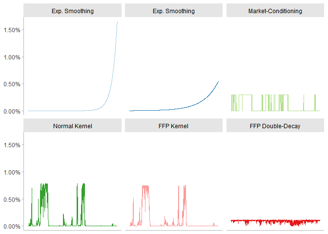

<!-- README.md is generated from README.Rmd. Please edit that file -->

# Fully-Flexible Probabilities

<!-- badges: start -->

[](https://lifecycle.r-lib.org/articles/stages.html#experimental)
[](https://github.com/Reckziegel/FFP/actions)
[](https://codecov.io/gh/Reckziegel/FFP?branch=main)
<!-- badges: end -->

> Functions for Scenario Analysis and Risk-Management

Oftentimes, the econometrician needs to stress-test the potential
outcomes for a given set of risk-drivers. This process can be
computationally costly when the entire set of scenarios needs to be
repriced (bootsraped, resampled, etc.).

To overcome this difficulty, the Fully-Flexible Probabilities (FFP)
approach offers an inexpensive way for scenario generation: it reprices
the *probabilities* associated to each scenario, instead of the
scenarios themselves. Once the new probabilities have been defined, the
computations can be performed very quickly because the burden associated
with scenario generation and valuation is left aside.

## Installation

You can install the development version of `ffp` from github with:

``` r
# install.packages("devtools")
devtools::install_github("Reckziegel/ffp")
```

## Probability Estimation

The package `ffp` comes with five functions to extract probabilities
from the historical scenarios:

-   `smoothing()`: accounts for the time-changing nature of volatility
    by giving more weight to recent observations;
-   `crisp()`: selects scenarios where a certain logical macroeconomic
    statement is satisfied;
-   `kernel_normal()`: generalizes the `crisp` condition by wrapping
    scenarios over a normal kernel;
-   `kernel_entropy()`: uses entropy-polling to satisfy a conditioning
    statement by distorting the least the prior probabilities;
-   `double_decay()`: uses entropy-polling and double-decay factor to
    constrain the first two moments of a distribution.



## Scenario Analysis

Once the probabilities have been estimated, `bootstrap_scenarios()` can
be used to sample data, while keeping the structure of the empirical
copulas intact. The main statistics of arbitrary scenarios can be
computed with `empirical_stats()`.

## References

-   Attilio Meucci (2021). Historical Scenarios with Fully Flexible
    Probabilities
    (<https://www.mathworks.com/matlabcentral/fileexchange/31360-historical-scenarios-with-fully-flexible-probabilities>),
    MATLAB Central File Exchange. Retrieved June 11, 2021.

-   De Santis, G., R. Litterman, A. Vesval, and K. Winkelmann, 2003,
    Covariance matrix estimation, Modern investment management: an
    equilibrium approach, Wiley.

-   Meucci, Attilio, Fully Flexible Views: Theory and Practice (August
    8, 2008). Fully Flexible Views: Theory and Practice, Risk, Vol. 21,
    No. 10, pp. 97-102, October 2008, Available at SSRN:
    <https://ssrn.com/abstract=1213325>

-   Meucci, Attilio, Historical Scenarios with Fully Flexible
    Probabilities (October 23, 2010). GARP Risk Professional, pp. 47-51,
    December 2010, Available at SSRN:
    <https://ssrn.com/abstract=1696802> or
    <http://dx.doi.org/10.2139/ssrn.1696802>
