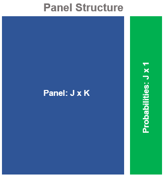

```{r, include = FALSE}
knitr::opts_chunk$set(
  collapse = TRUE,
  comment = "#>"
)
```

Entropy-pooling (EP) is a powerful Bayesian technique that can be used to construct and process *views* on many elements of a multivariate distribution. Entropy-pooling enhances the Black-Litterman (1990)[^1] model by supporting views on non-normal markets, non-linear payoffs, tails of the distribution and more. As a result, the portfolio construction process can be substantially enriched.

[^1]: Black, Fisher and Letterman, Robert (1990), Global Portfolio Optimization, _Financial Analyst Journal_, September 1992.

Formally, EP relies on the [Kullback-Leibner](https://en.wikipedia.org/wiki/Kullback%E2%80%93Leibler_divergence) divergence to quantify the entropy between different distributions. The main goal is to minimize:

<!-- In this case, how well the _posterior_ can be approximated to the _prior_.   -->

$$ \sum_{j=1}^{J} {x_j}(ln(x_j) - ln(p_j))$$
Subject to the restrictions:

$$ Fx_j  \le f \\ Hx_j = h $$

In which $x_j$ is a yet to be discovered _posterior_ probability; $p_j$ is a _prior_ probability distribution; and the vectors $F$, $f$, $H$ and $h$ (i.e. the _views_) act as linear constraints on $x_j$. 

When $x_j = p_j$, the relative entropy is zero and the two distributions coincide (i.e. the user views are in complete agreement with the market historical distribution). This is often unrealistic. Most commonly, the _views_ will differ and the objective function will seek a value for $x_j$ that deviates from $p_j$ with the minimal possible adjustment, just the enough to incorporate the _views_. 

The Lagrange can be formulated as:

$$ \mathcal{L}(x, \lambda, v) = x'(ln(x) - ln(p)) + \lambda'(Fx - f) + \nu'(Hx - h) $$
To which $\lambda$ is the Lagrange multiplier for the inequality constraint and $\nu$ is the multiplier for the equality constraint. The subscript $j$ is drooped to light the notation.

The first order condition with respect to $x$ yields:

$$ \frac{\partial \mathcal{L}}{\partial x} = ln(x) - ln(p) + 1 + F'\lambda + H'\nu$$
Set $\frac{\partial \mathcal{L}}{\partial x} = 0$ and separate the elements that contain $x$ from the rest to get:

$$ ln(x) = ln(p) - 1 - F'\lambda - H'\nu $$
As a last step, exponentiate both sides to find a closed form solution for $x$:

$$ x(\lambda, v) = e^{ln(p) - 1 - F'\lambda - H'\nu} $$

The solution is always positive and $x \ge 0$ is always satisfied. Nevertheless, $x$ still depends on the parameters, $\lambda$ and $\nu$, that can take any value.

In order to solve for $\lambda$ and $\nu$, set the dual formulation:

$$ D(\lambda, \nu) = \mathcal{L}(x(\lambda, \nu), \lambda, \nu) \\ s.t. \ \lambda \ge 0, \ \nu \ $$

This expression can be solved numerically, which allows to recover $\lambda^*$ and $\nu^*$, the optimal values for the Lagrange multipliers. 

Plug $\lambda^*$ and $\nu^*$ in the optimal expression for $x(\lambda, \nu)$:

```{=tex}
\begin{align*}
x(\lambda, \nu) &= e^{ln(p) - 1 - F'\lambda - H'\nu} \\ 
x^*(\lambda^*, \nu^*) &= e^{ln(p) - 1 - F'\lambda^* - H'\nu^*} \\  
x^*(\lambda^*, \nu^*) &= p^*
\end{align*}
```

To get the probability vector that incorporates the *views* by distorting the "least" the original probability vector.

Notice that the dual optimization only works on the multipliers $\lambda$
and $\nu$ (the number of constraints in the original problem). This "dimensionality reduction" is exactly what makes entropy-pooling feasible, even when the number of scenarios in the original dataset is large. 

In other words, for every $J$ realization (historical or simulated) the computational complexity is shrinked, because entropy-pooling only prices the _probabilities_ of each scenario, not the scenarios themselves (the $J \times K$ panel is treated as fixed).

```{r, echo=FALSE, fig.align='center'}

```

Since every realization in the $J \times K$ panel is connected to the $J \times 1$ vector of _posterior_ probabilities, the _conditional_ statistics on the P&L can be computed super fast.[^2]. As a result, EP can be used on “real-time”, without the computational burden of traditional Bayesian techniques.

[^2]: See the functions `ffp_moments()` and `empirical_stats()`.

<!-- In the `ffp` package, the numerical minimization of the relative entropy is implemented with `entropy_pooling()`. The function arguments differs from the notation in Meucci (2008)[^2] to keep consistency with the standard documentation in a wide range of available solvers. To that end, the table bellow shows that can be easy to migrate from one reading to another. -->

<!-- [^2]: Meucci, Attilio, Fully Flexible Views: Theory and Practice (August 8, 2008). Fully Flexible Views: Theory and Practice, Risk, Vol. 21, No. 10, pp. 97-102, October 2008, Available at SSRN: https://ssrn.com/abstract=1213325. -->

<!-- | Package | Paper |     Argument Type     | -->
<!-- |:-------:|:-----:|:---------------------:| -->
<!-- |  `Aeq`  | **H** |  Equality Constraint  | -->
<!-- |  `beq`  | **h** |  Equality Constraint  | -->
<!-- |   `A`   | **F** | Inequality Constraint | -->
<!-- |   `b`   | **f** | Inequality Constraint | -->

<!-- : Meucci (2008) vs. `ffp` Package -->

<!-- <!-- Entropy-pooling is appealing and has found it's applications on portfolio construction[^3] [^4] and risk-management[^5].  --> 

<!-- For more details, please, see the `entropy_pooling()` documentation or the package vignettes on the top of this page. -->

<!-- [^3]: Meucci, Attilio and Ardia, David and Colasante, Marcello, Portfolio Construction and Systematic Trading with Factor Entropy Pooling (May 8, 2014). Risk Magazine, Vol. 27, No. 5, pp. 56-61, 2014 , Available at SSRN: https://ssrn.com/abstract=1742559 or http://dx.doi.org/10.2139/ssrn.1742559. -->

<!-- [^4]: Georgelis, Nikos and Mikael Nyberg. “A Scenario Based Allocation Model Using Entropy Pooling for Computing the Scenario Probabilities.” (2013). -->

<!-- [^5]: Meucci, Attilio, Historical Scenarios with Fully Flexible Probabilities (October 23, 2010). GARP Risk Professional, pp. 47-51, December 2010, Available at SSRN: https://ssrn.com/abstract=1696802 or http://dx.doi.org/10.2139/ssrn.1696802. -->
